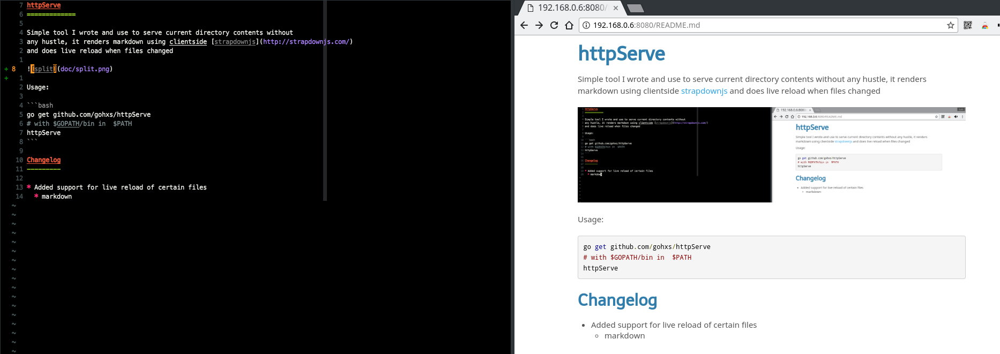

# httpServe

Simple tool that serves a folder and render some specific files

- Markdown (any .md)
  (it also renders some dot notation graphs)
- Wasm (if a folder contains a main.go file)
- dot files using http://url/file.dot?f=png

Watches for resources and tell browser to reload if any of the listen file changes



Usage:

```bash
go get github.com/stdiopt/httpserve/cmd/httpServe
# with $GOPATH/bin in  $PATH

httpServe
```
